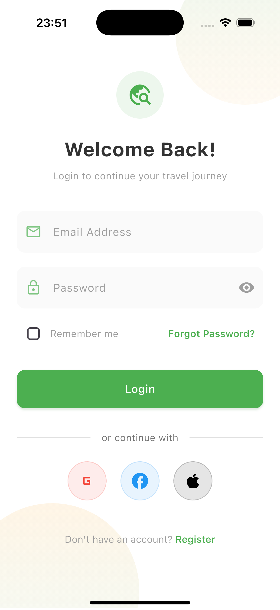
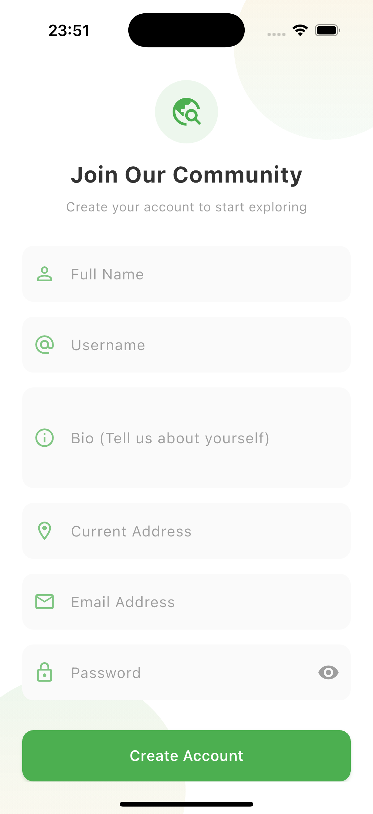

# Journey Junction - Travel Blog App

A beautifully designed travel blogging application that helps users discover, share, and document their travel experiences.

## ✨ Features

- **Explore** trending destinations and travel blogs
- **Create & Share** your own travel stories
- **Discover** hidden gems through community posts
- **Save** favorite locations and blogs
- **Personalized** travel recommendations

## 📱 Screenshots

<div style="display: flex; flex-wrap: wrap; gap: 10px;">
  
  

  
  
  
  
  
  
  
  
  
  
  
  
  
  
  
  
  
  
  
  
  
  
  
  
  

  
  
  
  
  
</div>

## 🛠️ Technical Stack

- **Framework**: Flutter 3.x
- **State Management**: GetX
- **Image Caching**: cached_network_image
- **UI Enhancements**: shimmer, flutter_screenutil
- **Styling**: Custom theme with app_styles.dart

## 🚀 Getting Started

### Prerequisites

- Flutter SDK (>=3.0.0)
- Dart (>=2.17.0)
- Android Studio/VSCode

## 🎨 UI Components

Key reusable components:

- `_GlowingIconButton` - Animated interactive buttons
- `_CategoryCard` - Uniform category display
- `_TrendingDestinationCard` - Destination cards with shimmer
- `_BlogCard` - Standardized blog post format

## 📂 Folder Structure

```
lib/
├── app/
│   ├── core/
│   │   ├── constants/        # Colors, styles, etc.
│   │   └── utils/            # Helper functions
│   └── presentation/         # All screens
│       ├── home/             # Home screen
│       ├── explore/          # Explore screen
│       └── profile/          # Profile screen
├── global/                   # Global widgets
└── main.dart                 # App entry point
```

## 🌟 Design Philosophy

1. **Performance First**:

   - Cached network images
   - Efficient state management
   - Minimal widget rebuilds

2. **Visual Appeal**:

   - Consistent spacing (using ScreenUtil)
   - Smooth animations
   - Attention to micro-interactions

3. **User Experience**:
   - Intuitive navigation
   - Clear visual hierarchy
   - Responsive layouts

## 🤝 Contributing

Pull requests are welcome! For major changes, please open an issue first to discuss what you'd like to change.

---

**Happy Travels!** ✈️🌍
